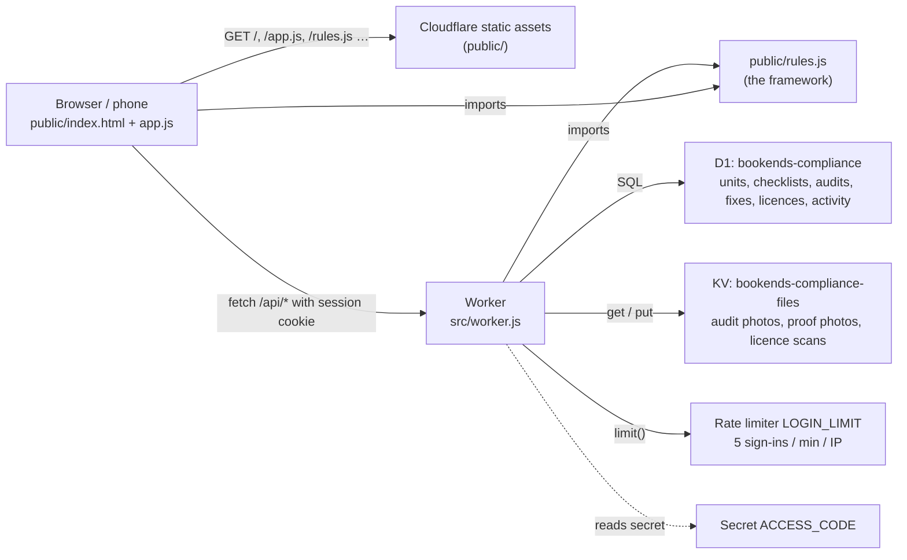
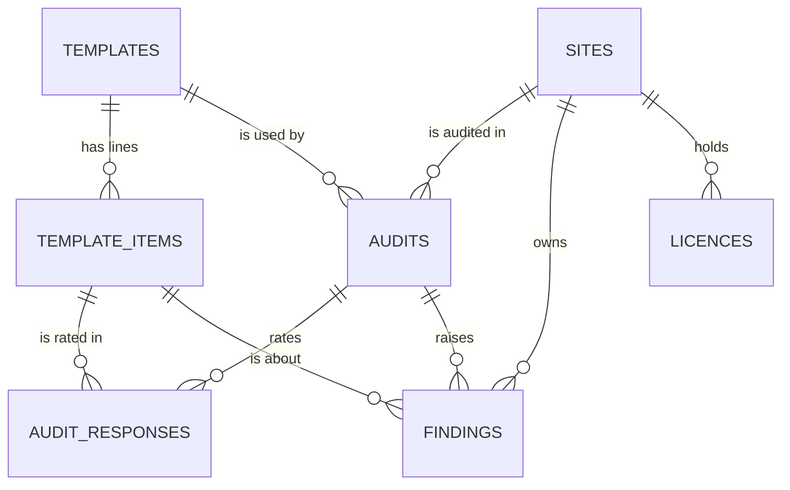

# Architecture

## At a glance

- **No build step, no framework.** What is in `public/` is what is served. `src/worker.js` is bundled by Wrangler on deploy, along with `public/rules.js`, which it imports.
- **One rules file for both sides.** `public/rules.js` is pure: no DOM, no I/O. The Worker uses it to score audits, set statuses and plan fixes. The browser uses it for the live score while auditing and for the Framework page.
- **Only `/api/*` runs the Worker** (`run_worker_first` in `wrangler.jsonc`). Every other path is a static file.

## Sign-in

- `POST /api/auth/login {name, code}`. The code is compared (constant-time, via SHA-256 digests) with the `ACCESS_CODE` Worker secret.
  On success the Worker sets `bk_session`: `base64url({name, exp}).HMAC-SHA256(ACCESS_CODE, payload)`, with `HttpOnly; SameSite=Lax; Secure; Max-Age=30 days`.
- Every other `/api/*` call checks that signature. **Changing `ACCESS_CODE` invalidates every session.**
- Wrong code: an 800 ms delay, then 401. More than 5 attempts a minute from one IP: 429 (`LOGIN_LIMIT` binding). No secret set: 503 with `setup: true`, and the sign-in page says so.
- The person's name is recorded on every audit, fix change and licence change (the `activity` table, plus `created_by`, `closed_by`).
- **Cloudflare Access (optional):** if Access is ever put in front, set `TRUST_ACCESS = "1"` and the Worker takes the e-mail from `Cf-Access-Authenticated-User-Email`.
  It ignores that header while the flag is `"0"`, because without Access anyone could send it.
- Other protections: writes from another origin are refused (Origin check); file keys must match a strict pattern; everything the front end renders is HTML-escaped by default (the `html` tagged template in `app.js`).

## Data model (D1)

| Table | What it holds | Notes |
| --- | --- | --- |
| `sites` | The 11 units ("sites" in code, "units" on screen) | `kind` = restaurant \| kitchen (decides which lines apply). `key` is a stable slug used by imports |
| `templates` | Checklists: 1 = FSSAI v1 (history), 2 = FSSAI v2 (active), 3 = maintenance docket (active) | `scheme` picks the rating labels in `rules.js`. **Never edit a template's items in place; add a new template.** |
| `template_items` | One row per checklist line | `code` (L16, K19, M35), `section`, `area`, `applies`, `critical` (★), `criticality` (docket), `weight` (full marks), `kind` (paperwork/physical) |
| `audits` | One visit | `score` (one decimal), `earned`, `possible`, `band`, `summary` (the auditor's conclusion), `source` (app/import), `source_ref` (original file), `flag` (data note) |
| `audit_responses` | One rating per line per audit | `result` = pass \| partial \| fail \| na, `points`, `note`, `photos` (JSON array of KV keys) |
| `findings` | The fix plan (gaps + corrective action) | `priority` = critical/major/minor (shown as P1/P2/P3), `rating`, `marks` (won back when closed), `kind`, `status`, `due_date`, `owner`, `root_cause`, `action_taken`, `evidence_key`, `is_repeat` |
| `licences` | Licence & certificate register | `severity` decides what an expiry does to the unit's status |
| `activity` | Append-only log: who did what, when | |

Visit numbers aren't stored: they are each audit's position among the unit's audits of that type, ordered by date.

## API

All responses are JSON. Everything except sign-in needs the session cookie.

| Method & path | Does |
| --- | --- |
| `POST /api/auth/login` | `{name, code}` → sets the session cookie |
| `POST /api/auth/logout` | Clears the cookie |
| `GET /api/me` | `{name, today}` (today is the business date in IST) |
| `GET /api/overview` | Everything the Overview page needs: unit summaries (visits, route to 80%, status), KPIs, problems shared by 3+ units, recent activity |
| `GET /api/sites` · `POST /api/sites` | List units (with summaries) · add one `{name, brand, area, city, kind, manager, manager_phone}` |
| `GET /api/sites/:id` · `PUT /api/sites/:id` | One unit with its audits, section scores, fixes, licences · edit (send `active: false` to archive) |
| `GET /api/templates` | All checklists with their lines |
| `GET /api/audits?site=&domain=` | Audit list with visit numbers |
| `POST /api/audits` | Submit an audit: `{site_id, domain, audit_date, auditor, audit_type, summary, answers: [{item_id, result, note, photos[]}]}`. The server scores it, raises fixes, and closes or carries forward the previous visit's fixes |
| `GET /api/audits/:id` | One audit with every line, section scores and its route to 80% |
| `GET /api/findings` · `GET /api/findings/:id` | The fix plan · one fix with its history |
| `PATCH /api/findings/:id` | Update a fix: `status`, `owner`, `due_date`, `root_cause`, `action_taken`, `evidence_key`, `close_note`, `note` (a reason, recorded in the history) |
| `GET/POST /api/licences` · `PUT/DELETE /api/licences/:id` | Licence register |
| `POST /api/uploads` | Raw image/PDF body (JPEG, PNG, WebP, PDF; 8 MB max) → `{key}`. Phones shrink photos to 1600 px before upload |
| `GET /api/files/<key>` | A stored file (keys `evidence/import/<sha>.<ext>` or `evidence/YYYY-MM/<uuid>.<ext>`) |
| `GET /api/activity?site=` | Recent activity |

## Front end

A single-page app with hash routes. Each page fetches its own data and renders HTML strings through the escaping `html` template.

| Route | Page |
| --- | --- |
| `#/` | Overview: where we are / where we want to be, KPIs, visit 1 → visit 2 → target chart, shared problems, maintenance, table |
| `#/fixes` | Fix plan: by priority or by problem. Filters: `status`, `priority`, `kind`, `domain`, `unit`, `view=problem` |
| `#/fixes/:id` | One fix: what the auditor saw, the corrective-action form, verify / send back / reopen, history |
| `#/units` · `#/units/:id` | Unit cards · one unit: status reasons, visit journey, section comparison, route to 80%, maintenance categories, fixes, history, licences |
| `#/audits` · `#/audits/:id` | Audit list · one audit: score, conclusion, section scores, route, every line with photos |
| `#/audits/new?unit=&domain=` | The phone audit flow: rate every line, remarks and photos for gaps, live score; the draft is saved on the device (`localStorage`) |
| `#/licences` | Licence register grouped by expiry |
| `#/framework` | The rules, drawn from `rules.js`, and the three checklists |

Design: Material Design 3 components written by hand in `app.css`, in the Bookends palette (royal blue `#00249C`, gold `#EEB22B`, ink `#12162B`), with light and dark themes.
It works from 360 px phones (bottom navigation and a floating "New audit" button) up to desktops (navigation rail). Fonts: Roboto Flex and Material Symbols Rounded from Google Fonts.
