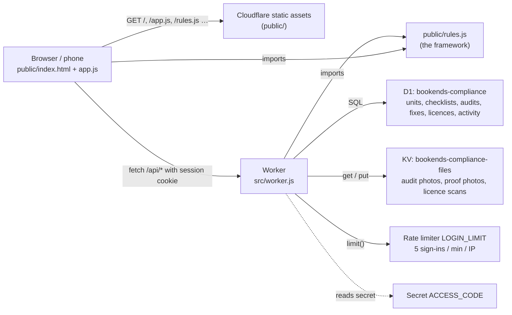
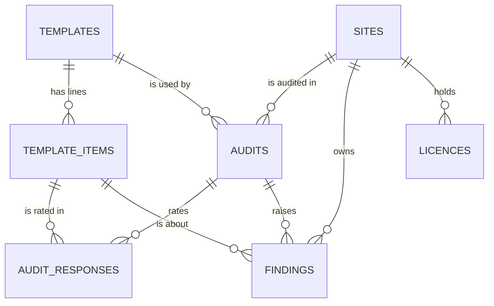

# Architecture

> **Oct 2026: moved off Cloudflare.** The website is now static files on Vercel; `/api/*` is a Vercel Function (`api/index.js` → `src/api.js`, which was `src/worker.js`).
> D1 became Supabase PostgreSQL (`src/db.js`, schema in `migrations-pg/`), KV became private Vercel Blob (`src/files.js`), and the sign-in rate limiter counts attempts in PostgreSQL (`src/platform.js`).
> The API, data model and front end below are otherwise unchanged. Set-up: [DEPLOY-VERCEL.md](DEPLOY-VERCEL.md).

## At a glance

- **No build step, no framework.** What is in `public/` is what is served. `src/worker.js` is bundled by Wrangler on deploy, along with `public/rules.js`, which it imports.
- **One rules file for both sides.** `public/rules.js` is pure: no DOM, no I/O. The Worker uses it to score audits, set statuses and plan fixes. The browser uses it for the live score while auditing and for the Framework page.
- **Only `/api/*` runs the Worker** (`run_worker_first` in `wrangler.jsonc`). Every other path is a static file.

## Sign-in

There are two ways in, side by side:

- **Personal accounts** (username + password), added by the Compliance Head in Settings → Team members (or **Add unit manager** on a unit page). There is no public sign-up.
  `POST /api/auth/login {username, password}`. Usernames are 3–40 letters, numbers, `.`, `_` or `-`, not case-sensitive. Passwords are stored only as `pbkdf2$100000$<salt>$<hash>` (PBKDF2-SHA256, random 16-byte salt); unknown username and wrong password give the same answer after the same delay.
  The session cookie carries `{name, uid, exp}`. On every request the Worker re-reads the account, so **disabling someone signs them out at once**, and renames show up on everything they record from then on.
  The Compliance Head sets each person's password when creating them (typed twice) and can set a new one later; that password is theirs to use straight away. People can change it themselves in Settings. (`must_change = 1` would ask for a new one at next sign-in; nothing sets it today.)
  **Roles** (migration `0005_user_roles.sql`):
  - `head`, **Compliance Head**: everything, and adds and manages people. The last active Compliance Head cannot be demoted or disabled, and nobody can disable themselves.
  - `manager`, **Unit Manager**: one unit (`users.site_id`), enforced in the Worker on every request, not only hidden in the screens. `loadState` and the list queries are filtered to that unit; a request for another unit's unit, audit, fix or licence answers 404. They can work on their unit's fixes (start work, owner, root cause, what was done, proof, mark fixed) and add or edit its licences. Running audits, adding or editing units, deleting licences, verifying / closing / sending back / reopening fixes, moving due dates and managing people answer 403 (`'head'` routes in the route table, plus the checks in `updateFinding`).
  **First Compliance Head:** while none exists, anyone signed in with the team code can create it from Settings; after that only a Compliance Head manages people.
- **The shared team code: first-time setup only.** While no Compliance Head exists, the sign-in page shows the name + team code form so the first one can be created. As soon as a Compliance Head exists, the Worker refuses the team code (403), signs out any session opened with it, and the page shows only username + password.

- `POST /api/auth/login {name, code}`. The code is compared (constant-time, via SHA-256 digests) with the `ACCESS_CODE` Worker secret.
  On success the Worker sets `bk_session`: `base64url({name, exp}).HMAC-SHA256(ACCESS_CODE, payload)`, with `HttpOnly; SameSite=Lax; Secure; Max-Age=30 days`.
- Every other `/api/*` call checks that signature. **Changing `ACCESS_CODE` invalidates every session.**
- Wrong code: an 800 ms delay, then 401. More than 5 attempts a minute from one IP: 429 (`LOGIN_LIMIT` binding). No secret set: 503 with `setup: true`, and the sign-in page says so.
- The person's name is recorded on every audit, fix change and licence change (the `activity` table, plus `created_by`, `closed_by`).
- **Cloudflare Access (optional):** if Access is ever put in front, set `TRUST_ACCESS = "1"` and the Worker takes the e-mail from `Cf-Access-Authenticated-User-Email`.
  It ignores that header while the flag is `"0"`, because without Access anyone could send it.
- Other protections: writes from another origin are refused (Origin check); file keys must match a strict pattern; everything the front end renders is HTML-escaped by default (the `html` tagged template in `app.js`).

## Data model (D1)

| Table | What it holds | Notes |
| --- | --- | --- |
| `sites` | The 11 units ("sites" in code, "units" on screen) | `kind` = restaurant \| kitchen (decides which lines apply). `key` is a stable slug used by imports |
| `templates` | Checklists: 1 = FSSAI v1 (history), 2 = FSSAI v2 (active), 3 = maintenance docket (active) | `scheme` picks the rating labels in `rules.js`. **Never edit a template's items in place; add a new template.** |
| `template_items` | One row per checklist line | `code` (L16, K19, M35), `section`, `area`, `applies`, `critical` (★), `criticality` (docket), `weight` (full marks), `kind` (paperwork/physical) |
| `audits` | One visit | `score` (one decimal), `earned`, `possible`, `band`, `summary` (the auditor's conclusion), `source` (app/import), `source_ref` (original file), `flag` (data note), `started_at` / `finished_at` (UTC; set automatically when the auditor begins the checklist and when they submit), `time_range` (written range from imported reports) |
| `audit_responses` | One rating per line per audit | `result` = pass \| partial \| fail \| na, `points`, `note`, `photos` (JSON array of KV keys) |
| `findings` | The fix plan (gaps + corrective action) | `priority` = critical/major/minor (shown as P1/P2/P3), `rating`, `marks` (won back when closed), `kind`, `status`, `due_date`, `owner`, `root_cause`, `action_taken`, `evidence_key`, `is_repeat` |
| `licences` | Licence & certificate register | `severity` decides what an expiry does to the unit's status |
| `activity` | Append-only log: who did what, when | |
| `users` | Personal accounts (migrations `0004`–`0006`) | `username` (unique, case-insensitive), `role` head \| manager, `site_id` (a Unit Manager's unit), `password_hash` (PBKDF2 only), `must_change`, `active`, `last_login_at` |

Visit numbers aren't stored: they are each audit's position among the unit's audits of that type, ordered by date.

## API

All responses are JSON. Everything except sign-in needs the session cookie.

| Method & path | Does |
| --- | --- |
| `POST /api/auth/login` | `{name, code}` → sets the session cookie |
| `POST /api/auth/logout` | Clears the cookie |
| `GET /api/auth/options` | Public: `{teamCode, setup}`: `teamCode` is true only while no Compliance Head exists (first-time setup) |
| `GET /api/me` | `{name, today, role, unit, username, mustChange, canManageUsers, firstAdminSetup, accountsReady}` (today is the business date in IST) |
| `POST /api/me/password` | `{current, password}`: change your own password (accounts only) |
| `GET /api/users` · `POST /api/users` | Compliance Head: list people (never the hashes) · add one `{name, username, role, site_id, password}` |
| `PUT /api/users/:id` · `POST /api/users/:id/password` | Compliance Head: `{name, role, site_id, active}` · set a new password `{password}` |
| `GET /api/overview` | Everything the Overview page needs: unit summaries (visits, route to 80%, status), KPIs, problems shared by 3+ units |
| `GET /api/sites` · `POST /api/sites` | List units (with summaries) · add one `{name, brand, area, city, kind, manager, manager_phone}` |
| `GET /api/sites/:id` · `PUT /api/sites/:id` | One unit with its audits, section scores, fixes, licences · edit (send `active: false` to archive) |
| `GET /api/templates` | All checklists with their lines |
| `GET /api/audits?site=&domain=` | Audit list with visit numbers |
| `POST /api/audits` | Submit an audit: `{site_id, domain, audit_date, auditor, audit_type, summary, answers: [{item_id, result, note, photos[]}]}`. The server scores it, raises fixes, and closes or carries forward the previous visit's fixes |
| `GET /api/audits/:id` | One audit with every line, section scores and its route to 80% |
| `GET /api/findings` · `GET /api/findings/:id` | The fix plan · one fix with its history |
| `PATCH /api/findings/:id` | Update a fix: `status`, `owner`, `due_date`, `root_cause`, `action_taken`, `evidence_key`, `close_note`, `note` (a reason, recorded in the history) |
| `GET/POST /api/licences` · `PUT/DELETE /api/licences/:id` | Licence register |
| `POST /api/uploads` | Raw image/PDF body (JPEG, PNG, WebP, PDF; 8 MB max) → `{key}`. Phones shrink photos to 1600 px before upload |
| `GET /api/files/<key>` | A stored file (keys `evidence/import/<sha>.<ext>` or `evidence/YYYY-MM/<uuid>.<ext>`) |
| `GET /api/activity?site=&limit=` | The audit log, newest first (default 200, max 1000), with fix titles and unit names. Compliance Head only (a Unit Manager gets 403) |

## Front end

A single-page app with hash routes. Each page fetches its own data and renders HTML strings through the escaping `html` template.

| Route | Page |
| --- | --- |
| `#/units?type=&status=&q=` · `#/units/:id?tab=` | Unit cards with search and filters · one unit with tabs: Overview (scores, why this status, visit 1 → 2 → target, route to 80%), Audits, Fixes, Licences, Photos |
| `#/audits?domain=&unit=&status=&from=&to=&q=` · `#/audits/:id` | Audit list · one audit: summary, findings grouped by priority (collapsible), then section scores, route and full checklist (collapsed) |
| `#/audits/new?unit=&domain=` | The phone audit flow as steps: basic details, one step per checklist section, review & submit; sticky Previous / Save draft / Next bar. The draft (including the current step) is saved on the device (`localStorage`) |
| `#/` (also `#/fixes?…`) · `#/fixes/:id` | **Dashboard = the fix plan** (no separate Fix Plan page): Open / Overdue / P1–P3 summary, filters (`status`, `priority`, `unit`, `due`, `kind`, `domain`, `q`, `view=problem`), fixes by priority or by problem. A Unit Manager sees their unit only. Older `#/fixes` links open it · one fix: key facts, description, evidence, review (Approve / Reject with a required reason, sent as the `note` of `PATCH status: open`, so it lands in the fix history), corrective action, history |
| `#/licences?status=&unit=` · `#/licences/:id` | Licence register; core licences not yet recorded show as "Not added" with an Add button |
| `#/reports?type=&unit=&period=…` | Report builder (food / maintenance / combined, unit, period). Built in the browser from the existing APIs; "Print / Save as PDF" uses the browser's print dialog |
| `#/settings` · `#/framework` | Account, team members, **audit log** (who did what, when; searchable, filter by type), theme, this device's audit draft, units · the rules, drawn from `rules.js`, and the checklists |

Global search (topbar, or press `/`) searches units, audits, fixes and licences from the existing list endpoints.

Design: hand-written CSS in `app.css` (tokens at the top, light and dark themes). Bookends royal blue is used for navigation and actions; colour otherwise only carries meaning (green on target, amber warning, red action required, grey neutral) and always comes with a text label.
Shared components in `app.js`: PageHeader, StatCard, StatusBadge, PriorityBadge, ScoreDisplay, ProgressBar, SearchBar, filter selects/segmented controls, EmptyState, ConfirmModal, FormModal, FindingCard, UnitCard, DataTable (rows become cards on phones), MobileBottomActions.
Layout: collapsible sidebar on desktop, hamburger drawer below 1024 px. Fonts: Inter and Material Symbols Rounded from Google Fonts.
